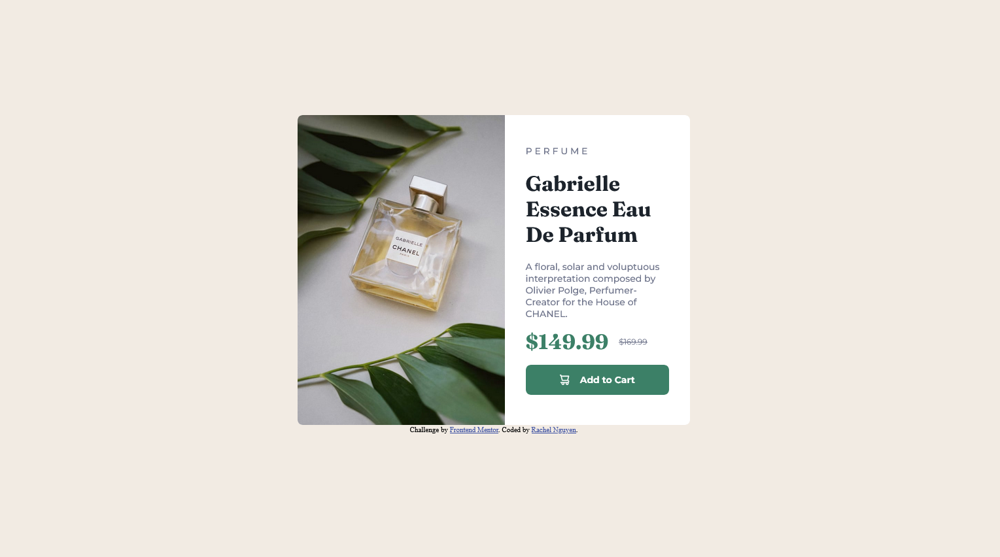

# Frontend Mentor - Product preview card component solution

This is a solution to the [Product preview card component challenge on Frontend Mentor](https://www.frontendmentor.io/challenges/product-preview-card-component-GO7UmttRfa). Frontend Mentor challenges help you improve your coding skills by building realistic projects. 

## Table of contents

- [Overview](#overview)
  - [The challenge](#the-challenge)
  - [Screenshot](#screenshot)
  - [Links](#links)
- [My process](#my-process)
  - [Built with](#built-with)
  - [What I learned](#what-i-learned)
  - [Continued development](#continued-development)
  - [Useful resources](#useful-resources)
- [Author](#author)

## Overview

### The challenge

Users should be able to:

- View the optimal layout depending on their device's screen size
- See hover and focus states for interactive elements

### Screenshots




### Links

- Solution URL: https://github.com/rangusun/ProductPreviewCardComponent
- Live Site URL: https://product-preview-card-component-red-six.vercel.app/

## My process

### Built with

- Semantic HTML5 markup
- CSS custom properties
- Flexbox
- Mobile-first workflow

### What I learned

After learning about the "mobile-first" approach, I decided to start building the mobile layout first for this project to see how it improved my workflow in developing responsive layouts. I found this approach to work great with my workflow since it was easier to develop the desktop-layout afterwards because there is more space to work with and you already have most of the components built. I did have some trouble figuring out the padding and width sizes for the desktop layout to display the image and product details cleanly and close to the example images as possible. However, that was solved by experimenting with widths and padding of elements which I became more comfortable with eyeballing the examples.

Another new concept I learned while developing this project was utilizing media queries and `<picture>` element to display the appropriate card layout for different screens. This helped greatly when building desktop layout so that the component can display correctly for different screen sizes without adding so much more code to do so.

```html
<picture class="product-img-container">
  <source media="(width > 600px)" srcset="images/image-product-desktop.jpg">
  
</picture>
```
```css
@media (width > 600px) {

    .product-img {
        width: 100%;
        border-top-left-radius: 0.5em;
        border-bottom-left-radius: 0.5em;
        border-top-right-radius: 0;
        vertical-align: bottom;
    }

    .product-preview-card {
        display: flex;
        flex-direction: row;
        max-width: 600px;
    }

    .details-container {
        width: 80%;
        padding: 2em;
        align-self: center;
    }
}
```

### Continued development

I would like to continue using the 'mobile-first' approach since I found it helpful in building responsive layouts quickly for different screen sizes. I felt like it improved my workflow to build responsiveness faster.

I also want to improve on using relative units, like 'em' and 'rem', for paddings, margins, and more for better responsive layouts.

### Useful resources

- [Conquering Responsive Layouts](https://courses.kevinpowell.co/conquering-responsive-layouts) - This helped me learn the basics of responsive design and understand why certain concepts and design are used in HTML and CSS in order to achieve responsiveness.
- [MDN Web Docs](https://developer.mozilla.org/en-US/) - A great resource for learning everything about web development and technologies.

## Author

- Frontend Mentor - [@rangusun](https://www.frontendmentor.io/profile/rangusun)

